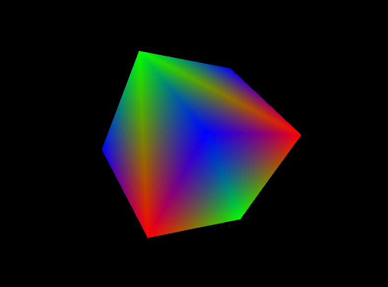

> [!WARNING]
> Highly beta, PRs are welcome.


# Hvat?
This is a basic 3D engine implemented in C. It works with [OpenGL Graphics API](https://learnopengl.com/Getting-started/OpenGL) and uses [Glad](https://glad.dav1d.de/) loader. 

How does it create a window? [SDL2 library](https://www.libsdl.org/). 

# Dependencies
- [SDL2](https://wiki.libsdl.org/SDL2/Installation#supported_platforms)

# Build
Firstly, clone the repository and initialize submodules(dependencies, like [cglm](https://github.com/recp/cglm)). 
```
$ git clone --recurse-submodules https://github.com/Naakinn/3D-Engine
```

Then build and run. 
```
$ make
$./engine
```

### Build in debug mode or in release mode
```
$ make
# or 
$ make release
```
# Features 

1. Add textures, example texture can be found [here](textures/texture.jpg).
> [!warning]
> This feature is not implemented yet))) coming soon.
   ```
   $ ./engine -t texture.jpg
   ```
# Contributing
1. You may want to create a .tar.gz binary using `make package`.
2. You can format entire progect(except src/glad.c file, which is [autogenerated](https://glad.dav1d.de/)) with `make format` 
